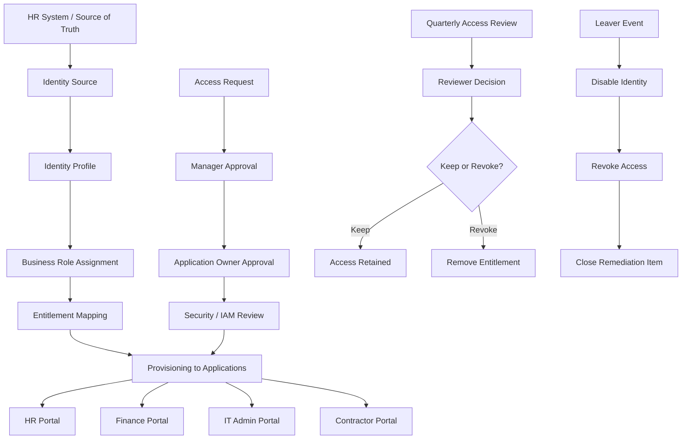

# IGA Flow Diagram

## Summary

This diagram shows a simulated IGA workflow:

- HR system provides identity data
- Identity profile drives role assignment
- Roles map to application entitlements
- Access requests require approval
- Access reviews validate continued need
- Revocation removes unnecessary or expired access
